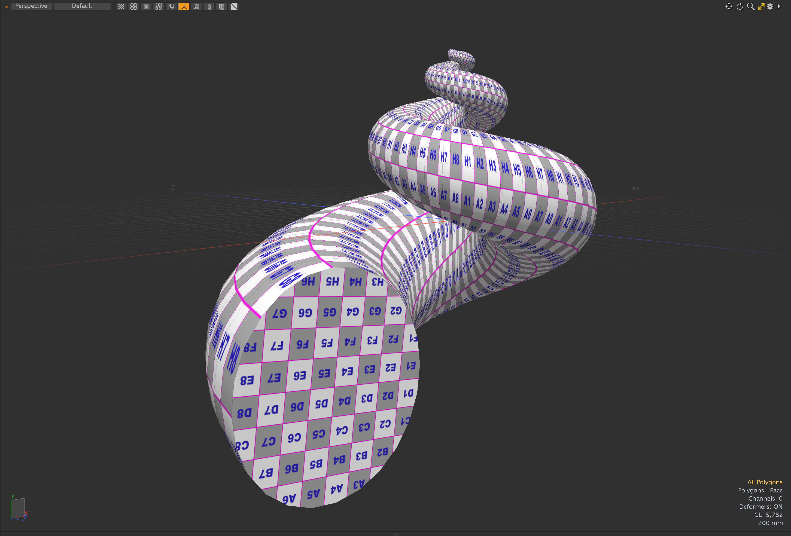

# Seashell Python sample codes for Modo plug-ins

This is a collection of Python example for Foundry 3DCG application Modo plugin. The original seashell plugin is an example of Modo LXSDK written by C++ and it works as direct modeling tool. This kit contains python scripts to show how to write Modo plugins using Phthon. The algorithm between the original C++ and this python scripts are same. The original seashell example is in tool/samples folder in Modo LXSDK.

## Modo plug-ins
- **seashell.command**:
This is a modeling command version of seashell. It takes profile polygons and creates a seashell shape with the given attributes. You can use this by typing "**seashell.command**" at command field of Command History viewport.
- **seashell.meshop.item**:
This is a mesh modifier version of seashell for procedural modeling workflow. This is available on Mesh Operator viewport under Polygon tab.
- **seashell.tool**:
This is a direct tool version of seashell. It takes profile polygons and creates a seashell shape with the given attributes. You can use this by typing "**tool.set seashell.tool on**" at command field of Command History viewport.

## Blender Operator
- **bmesh_seashell.py**
This is a Blender operator version of seashell. It takes profile polygons and creates a seashell shape with the given attributes. You can use this by typing "**bpy.ops.mesh.seashell()**" at Python console.

## Installing
- Open user context folder by choosing "**Open Content Folder**" under System menu of Modo.
- Put this "**seashell**" folder in "**Kits**" folder in the user context folder.
- You can see "**Seashell_Examples version 1.0**" in "**Kits Version**" under Help menu of Modo.